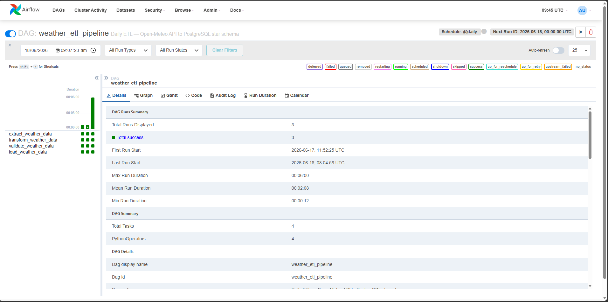
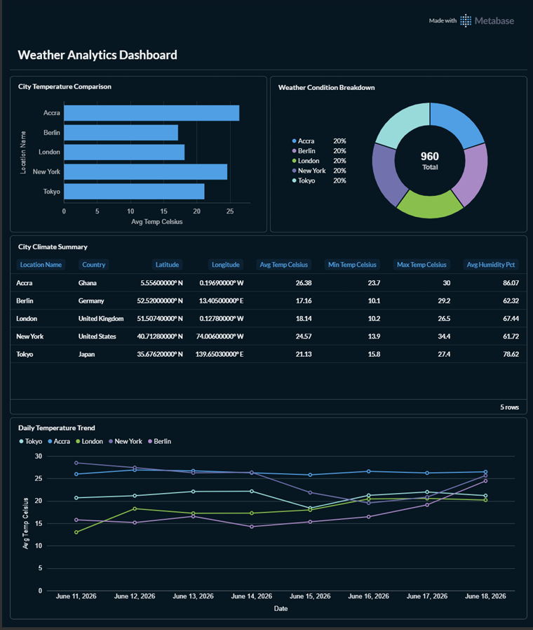
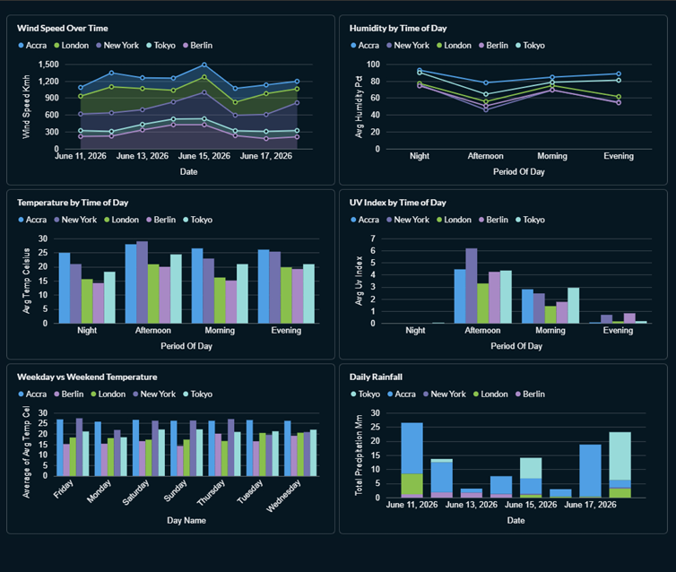

# Weather Analytics Data Pipeline

A production-grade data engineering project implementing both **ETL** and **ELT** patterns to ingest hourly weather data from the [Open-Meteo API](https://open-meteo.com/) into a PostgreSQL star schema, orchestrated by Apache Airflow and visualised with Metabase.

---

## Table of Contents

- [Overview](#overview)
- [Architecture](#architecture)
- [Tech Stack](#tech-stack)
- [Project Structure](#project-structure)
- [Pipeline Design](#pipeline-design)
  - [ETL Pipeline](#etl-pipeline)
  - [ELT Pipeline](#elt-pipeline)
- [Star Schema](#star-schema)
- [Screenshots](#screenshots)
- [Getting Started](#getting-started)
- [Running Tests](#running-tests)
- [Documentation](#documentation)
- [Configuration Reference](#configuration-reference)

---

## Overview

This project demonstrates two complementary data pipeline patterns operating on the same source and target:

- The **ETL pipeline** transforms data in Python (Pandas) before writing to the analytics database. It is orchestrated by an Apache Airflow DAG with a dedicated validation gate between transform and load.
- The **ELT pipeline** loads raw data into a PostgreSQL staging table first, then transforms it using SQL. Idempotency is enforced at the row level through an `is_processed` flag.

Both pipelines converge on the same **star schema** in a dedicated analytics database and are visualised through **Metabase** dashboards.

**What the pipeline tracks**: 15 hourly weather variables (temperature, humidity, precipitation, wind speed, UV index, pressure, and more) across 5 cities — Accra, London, New York, Tokyo, and Berlin.

---

## Architecture

```text
┌─────────────────────────────────────────────────────────────────┐
│                        Open-Meteo API                           │
│              (free, public, no auth required)                   │
└──────────────────────────────┬──────────────────────────────────┘
                               │  HTTP / JSON
              ┌────────────────┴────────────────┐
              │                                 │
              ▼                                 ▼
   ┌─────────────────────┐          ┌─────────────────────┐
   │    ETL Pipeline      │          │    ELT Pipeline      │
   │  (jobs/etl/)        │          │  (jobs/elt/)        │
   │                     │          │                     │
   │ Extract → Transform  │          │ Extract → Stage     │
   │ (Python/Pandas)      │          │ (raw PostgreSQL)    │
   │         │            │          │        │            │
   │         ▼            │          │        ▼            │
   │   data/raw/*.csv     │          │ weather_raw_staging │
   │ (audit trail)        │          │ (is_processed flag) │
   │         │            │          │        │            │
   │         ▼            │          │        ▼            │
   │    Load to DB        │          │ Transform (SQL)     │
   └──────────┬───────────┘          └──────────┬──────────┘
              │                                 │
              └────────────────┬────────────────┘
                               │
                               ▼
              ┌────────────────────────────────┐
              │       postgres_analytics        │
              │      (Star Schema, port 5433)   │
              │                                │
              │  dim_location  dim_date        │
              │  dim_time      dim_weather_cond │
              │  fact_weather                  │
              └────────────────┬───────────────┘
                               │
                               ▼
              ┌────────────────────────────────┐
              │           Metabase              │
              │   (Dashboards, port 3000)       │
              └────────────────────────────────┘

  Orchestration: Apache Airflow (webserver + scheduler, port 8080)
  Scheduling:    @daily  |  Retries: 1 × 5 min delay per task
```

---

## Tech Stack

| Layer | Technology |
| --- | --- |
| **Language** | Python 3.11 |
| **Data transformation** | Pandas 2.2, NumPy 1.26 |
| **Databases** | PostgreSQL 14 (staging + analytics), PostgreSQL 13 (Airflow metadata) |
| **Orchestration** | Apache Airflow 2.9.2 |
| **Containerisation** | Docker, Docker Compose |
| **Visualisation** | Metabase |
| **Data source** | Open-Meteo API (free, no API key) |
| **Testing** | pytest 8.2, pytest-mock 3.14 |
| **HTTP client** | requests + urllib3 (retry + backoff) |

---

## Project Structure

```text
.
├── airflow/
│   ├── dags/
│   │   └── weather_etl_dag.py      # Daily ETL DAG (4 tasks, @daily)
│   └── logs/                       # Airflow task logs
│
├── jobs/
│   ├── config.py                   # All configuration — env vars, API, DB, locations
│   ├── utils/
│   │   └── logger.py               # Rotating file + console logger (10 MB, 5 backups)
│   ├── etl/
│   │   ├── extraction.py           # WeatherExtractor — HTTP client with retry/backoff
│   │   ├── transform.py            # WeatherDataTransformer — Pandas validation + enrichment
│   │   ├── load.py                 # WeatherDataLoader — star schema upserts
│   │   └── main.py                 # ETL orchestrator
│   └── elt/
│       ├── extract.py              # extract_raw() — reuses ETL extractor
│       ├── transform.py            # StagingTransformer — SQL-based transformation
│       ├── load.py                 # StagingLoader — staging inserts + mark_processed
│       └── main.py                 # ELT orchestrator
│
├── sql/
│   ├── init_staging.sql            # Staging table DDL
│   ├── init_analytics.sql          # Star schema DDL + indexes
│   └── views_analytics.sql         # 5 analytical views
│
├── models/
│   └── schema.sql                  # Single-file reference copy of full schema
│
├── tests/
│   ├── conftest.py                 # Shared fixtures
│   ├── etl/                        # 76 ETL tests
│   └── elt/                        # 44 ELT tests
│
├── data/
│   ├── raw/                        # Raw CSV snapshots (ETL audit trail)
│   └── processed/                  # Transformed CSV snapshots
│
├── docs/                           # 14 documentation files (see Documentation section)
├── logs/                           # pipeline.log (rotating, 10 MB)
├── .env.example                    # Required environment variables template
├── docker-compose.yml              # Full stack — 10 services
├── Dockerfile                      # Airflow image with psycopg2 and project deps
└── requirements.txt
```

---

## Pipeline Design

### ETL Pipeline

Transforms data **in Python** before it touches the database. Orchestrated by the Airflow DAG `weather_etl_pipeline`.

```text
extract_weather_data
        │
        │  Open-Meteo API → 7-day lookback × 5 cities
        │  Retry: 3× with 2s/4s/8s exponential backoff
        │  Saves raw CSV to data/raw/ (audit trail)
        ▼
transform_weather_data
        │
        │  Column renames  →  temperature_2m → temperature_celsius
        │  Type casting    →  string → datetime / float
        │  Null handling   →  drop critical nulls, fill precip with 0.0
        │  Range checks    →  temp: −90 to 60°C, humidity: 0–100%, etc.
        │  Deduplication   →  by (timestamp, location, country)
        │  Derived fields  →  Fahrenheit, period_of_day, weather labels
        ▼
validate_weather_data                 ← explicit quality gate
        │
        │  Raises ValueError if:
        │    - required columns missing
        │    - DataFrame is empty
        ▼
load_weather_data
        │
        │  Upserts dim_location, dim_date, dim_time, dim_weather_condition
        │  Inserts fact_weather — ON CONFLICT (location_id, date_id, time_id) DO NOTHING
        ▼
postgres_analytics  (star schema)
```

**Retry policy**: 1 Airflow-level retry per task with a 5-minute delay, independent of the 3 urllib3-level retries inside the extractor.

---

### ELT Pipeline

Loads raw data **first**, then transforms it using SQL inside PostgreSQL. Runs as a standalone container.

```text
extract_raw()
        │  Same WeatherExtractor as ETL — reused, not duplicated
        ▼
StagingLoader.load()
        │  Inserts untyped rows into weather_raw_staging
        │  All measurements stored as NUMERIC (no type constraints)
        │  is_processed = FALSE, loaded_at = NOW()
        ▼
postgres_staging  (weather_raw_staging)
        │
        ▼
StagingTransformer.transform()
        │  SQL SELECT WHERE is_processed = FALSE
        │  Type casts, EXTRACT(), COALESCE(), CASE WHEN — all in SQL
        │  Returns (transformed_df, staging_row_ids)
        ▼
WeatherDataLoader.load()              ← shared with ETL
        │  Same star schema upserts + ON CONFLICT DO NOTHING
        ▼
StagingLoader.mark_processed(ids)
        │  UPDATE is_processed = TRUE
        │  Only called AFTER analytics load succeeds
        ▼
postgres_analytics  (star schema)
```

**Idempotency**: `is_processed` acts as an explicit watermark. Failed runs leave rows unprocessed; the next run picks them up. `ON CONFLICT DO NOTHING` on the fact table provides a second defence layer.

---

## Star Schema

```text
          dim_location           dim_weather_condition
         ┌────────────┐         ┌──────────────────────┐
         │ location_id│         │ condition_id          │
         │ location_name        │ weather_code (WMO)    │
         │ country    │         │ description           │
         │ latitude   │         │ category              │
         │ longitude  │         └──────────┬───────────┘
         └─────┬──────┘                    │
               │                           │
               │      ┌────────────────────┴──────────────┐
               │      │          fact_weather              │
               └─────►│  PK: fact_id                      │◄────┐
                       │  FK: location_id                  │     │
         dim_date      │  FK: date_id                      │     │
         ┌──────────┐  │  FK: time_id                      │     │
         │ date_id  ├─►│  FK: condition_id                 │     │
         │ full_date│  │  temperature_celsius / fahrenheit  │     │
         │ year     │  │  relative_humidity_pct             │     │
         │ month    │  │  precipitation_mm                  │     │
         │ day      │  │  wind_speed_kmh / direction / gusts│     │
         │ quarter  │  │  pressure_hpa, uv_index            │     │
         │ is_weekend  │  visibility_m, cloud_cover_pct     │     │
         └──────────┘  │  is_day, extracted_at             │     │
                       │  UNIQUE (location_id, date_id,    │     │
                       │          time_id)                  │     │
                       └───────────────────────────────────┘     │
                                                                   │
         dim_time                                                   │
         ┌────────────┐                                            │
         │ time_id    ├───────────────────────────────────────────┘
         │ hour (0–23)│
         │ period_of_day (Night/Morning/Afternoon/Evening)
         └────────────┘
```

**Grain**: one row per city per hour per day. Enforced by `UNIQUE (location_id, date_id, time_id)`.

Five pre-built analytical views in `sql/views_analytics.sql`:

| View | Description |
|---|---|
| `vw_hourly_weather` | Full denormalised hourly readings |
| `vw_daily_weather_summary` | Avg/min/max per location per day |
| `vw_location_climate_comparison` | All-time summary per city |
| `vw_weather_condition_frequency` | WMO condition occurrence rates |
| `vw_weather_by_period_of_day` | Averages by time-of-day slot |

---

## Screenshots

### Airflow — DAG Run History

The `weather_etl_pipeline` DAG with 3 successful runs. Tasks run in strict sequence: extract → transform → validate → load.



---

### Metabase — Weather Analytics Dashboard

City temperature comparison, weather condition breakdown, city climate summary table, and daily temperature trend across all 5 cities.



---

### Metabase — Time-Series & Period Analysis

Wind speed over time, humidity by time of day, temperature by period, UV index, weekday vs weekend temperature, and daily rainfall.



---

## Getting Started

### Prerequisites

- [Docker Desktop](https://www.docker.com/products/docker-desktop/) (includes Docker Compose)
- Git

### 1. Clone the Repository

```bash
git clone https://github.com/Jerry-Khobby/Etl-Elt-Weather-Analytics-Data-Pipeline.git
cd Etl-Elt-Weather-Analytics-Data-Pipeline
```

### 2. Configure Environment Variables

```bash
cp .env.example .env
```

Open `.env` and set your passwords. The defaults work out of the box for local development:

```dotenv
AIRFLOW_DB_USER=airflow
AIRFLOW_DB_PASSWORD=your_password_here
AIRFLOW_FERNET_KEY=          # generate: python -c "from cryptography.fernet import Fernet; print(Fernet.generate_key().decode())"
AIRFLOW_ADMIN_USERNAME=admin
AIRFLOW_ADMIN_PASSWORD=your_password_here

STAGING_DB_NAME=staging_db
STAGING_DB_USER=staging_user
STAGING_DB_PASSWORD=your_password_here

ANALYTICS_DB_USER=analytics_user
ANALYTICS_DB_PASSWORD=your_password_here
ANALYTICS_DB_NAME=weather_analytics
```

> The `.env` file is in `.gitignore` and will never be committed.

### 3. Start the Full Stack

```bash
docker compose up -d
```

This starts 10 services. Allow ~60 seconds for all health checks to pass:

| Service | Purpose | Port |
|---|---|---|
| `postgres_airflow` | Airflow metadata DB | internal |
| `postgres_staging` | ELT raw staging DB | 5434 |
| `postgres_analytics` | Analytics star schema | 5433 |
| `airflow-init` | DB migration + admin user (one-shot) | — |
| `airflow-server` | Airflow web UI | 8080 |
| `airflow-scheduler` | DAG scheduler | — |
| `etl` | Standalone ETL container | — |
| `elt` | Standalone ELT container | — |
| `metabase` | Dashboard visualisation | 3000 |
| `test` | pytest runner | — |

### 4. Verify Services

```bash
docker compose ps
```

All persistent services should show `(healthy)`.

### 5. Access the Interfaces

| Interface | URL | Default credentials |
|---|---|---|
| Airflow UI | http://localhost:8080 | admin / (set in `.env`) |
| Metabase | http://localhost:3000 | Set up on first visit |

### 6. Trigger the ETL Pipeline

The Airflow DAG runs automatically `@daily`. To trigger it immediately:

```bash
# Via Airflow UI: DAGs → weather_etl_pipeline → Trigger DAG ▶
# Or via CLI:
docker exec -it airflow-scheduler \
  airflow dags trigger weather_etl_pipeline
```

### 7. Run the ELT Pipeline Manually

```bash
docker compose run elt
```

---

## Running Tests

```bash
# Via Docker (no local Python needed)
docker compose run test

# Or locally with a virtual environment
python -m venv venv
source venv/bin/activate        # Windows: venv\Scripts\activate
pip install -r requirements.txt
pytest

# Specific test targets
pytest tests/etl/               # ETL tests only
pytest tests/elt/               # ELT tests only
pytest tests/etl/test_transform.py -v   # single file, verbose
```

The test suite contains ~120 unit tests. All tests are fully isolated — no live API or database connections are required. Every external call is mocked via `pytest-mock`.

---

## Documentation

Detailed documentation for every engineering decision is in [`docs/`](docs/):

**Data Engineering Patterns**

| Document | Topic |
|---|---|
| [etl-vs-elt.md](docs/etl-vs-elt.md) | Why each pattern was chosen, full flow diagrams, tradeoffs |
| [idempotency.md](docs/idempotency.md) | `ON CONFLICT DO NOTHING`, `is_processed` flag, DDL guards |
| [incremental-loading-and-backfills.md](docs/incremental-loading-and-backfills.md) | 7-day rolling window, `is_processed` watermark, backfill procedures |
| [data-lineage.md](docs/data-lineage.md) | End-to-end value trace from API JSON → staging → fact table |
| [star-schema-design.md](docs/star-schema-design.md) | Grain, dimension rationale, surrogate vs natural keys |
| [slowly-changing-dimensions.md](docs/slowly-changing-dimensions.md) | SCD Type 1 implementation, Type 2 migration path |
| [schema-evolution.md](docs/schema-evolution.md) | API field added/removed/renamed — what breaks and what to change |

**Data Quality & Reliability**

| Document | Topic |
|---|---|
| [validation-rules.md](docs/validation-rules.md) | Range checks, null handling, type coercion — all four validation layers |
| [data-quality-monitoring.md](docs/data-quality-monitoring.md) | Structured log levels, Airflow task states as quality signals |
| [deduplication-strategy.md](docs/deduplication-strategy.md) | Python `drop_duplicates`, DB unique constraint, ELT flag |
| [error-handling-and-retries.md](docs/error-handling-and-retries.md) | urllib3 retry strategy, timeout config, DB pool pre-ping |
| [logging-and-observability.md](docs/logging-and-observability.md) | Log format, rotating file handler, what each level emits |
| [orchestration-and-scheduling.md](docs/orchestration-and-scheduling.md) | Airflow DAG anatomy, task dependencies, XCom, retry policy |
| [alerting-and-failure-notification.md](docs/alerting-and-failure-notification.md) | Current gaps + Slack/email alerting design |

**Governance & Maintainability**

| Document | Topic |
|---|---|
| [configuration-management-and-secrets.md](docs/configuration-management-and-secrets.md) | `.env` boundary, `load_dotenv`, Docker Compose injection |
| [testing-strategy.md](docs/testing-strategy.md) | All 120 tests — what's covered, what's not, mocking approach |
| [code-modularity.md](docs/code-modularity.md) | Extract/transform/load separation, single responsibility, dependency direction |
| [versioning-and-schema-migration.md](docs/versioning-and-schema-migration.md) | Git versioning, idempotent DDL, manual migration procedures, Alembic comparison |
| [runbook.md](docs/runbook.md) | Failure triage by symptom, diagnostic commands, manual backfill |
| [assumptions-and-limitations.md](docs/assumptions-and-limitations.md) | Explicit scope boundaries — PII, single source, daily granularity, etc. |

---

## Configuration Reference

All values are set in `.env` and consumed via `jobs/config.py`.

| Variable | Default | Description |
|---|---|---|
| `ANALYTICS_DB_USER` | `analytics_user` | Analytics PostgreSQL user |
| `ANALYTICS_DB_PASSWORD` | — | Analytics PostgreSQL password |
| `ANALYTICS_DB_NAME` | `weather_analytics` | Analytics database name |
| `ANALYTICS_DB_HOST` | `localhost` | Analytics DB host |
| `ANALYTICS_DB_PORT` | `5432` | Analytics DB port (5433 in Docker) |
| `STAGING_DB_USER` | `staging_user` | Staging PostgreSQL user |
| `STAGING_DB_PASSWORD` | — | Staging PostgreSQL password |
| `STAGING_DB_NAME` | `staging_db` | Staging database name |
| `STAGING_DB_HOST` | `localhost` | Staging DB host |
| `STAGING_DB_PORT` | `5434` | Staging DB port |
| `AIRFLOW_FERNET_KEY` | — | Airflow encryption key (generate before first run) |
| `AIRFLOW_ADMIN_USERNAME` | `admin` | Airflow UI username |
| `AIRFLOW_ADMIN_PASSWORD` | — | Airflow UI password |
| `LOG_LEVEL` | `INFO` | Pipeline log verbosity (`DEBUG` / `INFO` / `WARNING`) |
| `LOG_DIR` | `logs/` | Directory for `pipeline.log` |

**Hardcoded pipeline parameters** (edit `jobs/config.py` directly):

| Parameter | Value | Description |
|---|---|---|
| `LOOKBACK_DAYS` | `7` | Days of history fetched per pipeline run |
| `MAX_RETRIES` | `3` | urllib3 retry attempts per API call |
| `RETRY_BACKOFF_FACTOR` | `2` | Exponential backoff multiplier (2s → 4s → 8s) |
| `REQUEST_TIMEOUT_SECONDS` | `30` | Hard timeout per HTTP request |
| `LOCATIONS` | 5 cities | Accra, London, New York, Tokyo, Berlin |
